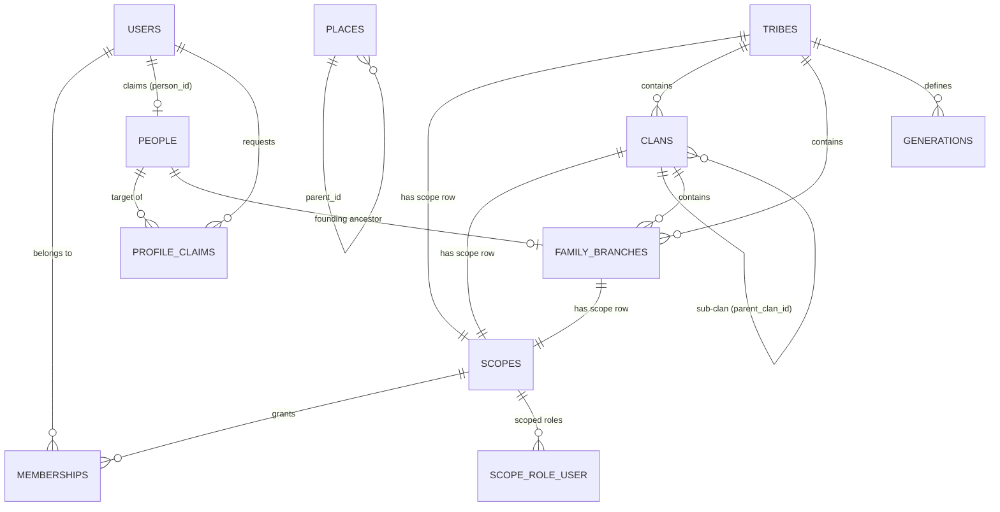
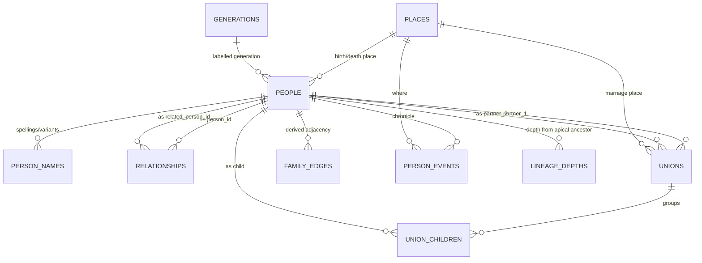
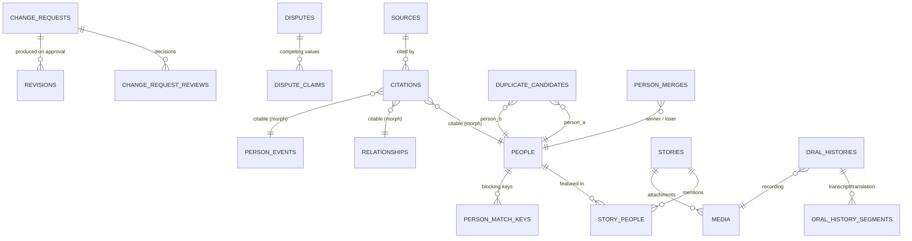

# 02 — Database Architecture

MySQL 8.4+ / InnoDB / `utf8mb4_0900_ai_ci`. Recursive CTEs and window functions are
required features, not optional.

---

## 1. Conventions

**Identifiers.** Every table has `id BIGINT UNSIGNED AUTO_INCREMENT` as the internal
primary key and, for anything a client can address, a `ulid CHAR(26)` public identifier
with a unique index. Rationale: 8-byte integer keys keep InnoDB secondary indexes and
the traversal hot path small (a UUID PK inflates every secondary index by 24 bytes and
randomises insert order); ULIDs are monotonic, URL-safe and never expose row counts.
Route model binding resolves on `ulid`. **Internal `id` values never appear in an API
response.**

**Dates you cannot trust.** Genealogy dates are frequently partial or approximate.
Every date fact uses a four-column pattern rather than a single `DATE`:

| Column | Type | Meaning |
|---|---|---|
| `x_date` | `DATE NULL` | Normalised to the earliest day of the known period (1932 → `1932-01-01`) |
| `x_date_end` | `DATE NULL` | Upper bound for `between` / `about` / `decade` |
| `x_date_precision` | `ENUM` | `exact, month, year, decade, about, before, after, between, unknown` |
| `x_date_text` | `VARCHAR(120) NULL` | Verbatim as written in the source ("abt. 1902", "before the war") |

Plus a derived `x_year SMALLINT NULL` for indexed range queries and matching. This is
GEDCOM-compatible and survives round-tripping.

**Soft deletes.** `deleted_at` on user-authored content: `people`, `relationships`,
`unions`, `person_events`, `stories`, `sources`, `media`, `places`, `tribes`, `clans`,
`family_branches`. **No** soft delete on ledgers — `revisions`, `change_requests`,
`change_request_reviews`, `audit_logs`, `person_merges` are append-only and never
deleted; erasing them would destroy the audit trail that justifies the schema.

**Soft delete + unique indexes.** MySQL treats `NULL`s as distinct, so a unique index
containing `deleted_at` does not prevent duplicate *live* rows. Every table needing a
unique constraint alongside soft deletes carries:

```sql
deleted_token BIGINT UNSIGNED NOT NULL DEFAULT 0   -- 0 = live, else = row id
UNIQUE KEY uq_... (col_a, col_b, ..., deleted_token)
```

A `SoftDeletesWithUniqueness` trait sets `deleted_token = id` on delete and back to `0`
on restore, inside the same transaction.

**Attribution.** Contributable tables carry `created_by`, `updated_by`, `verified_by`
(all `FK users.id ON DELETE SET NULL`) and `verified_at`. Set by a `Contributable` trait,
never by client input.

**Statuses.** Two distinct enums, often confused:
- `status` — lifecycle of the record: `draft, active, archived, hidden`
- `verification_status` — evidential state of the claim: `unverified, pending, verified, disputed, rejected`

**Foreign keys.** Real FKs everywhere. `ON DELETE RESTRICT` for structural parents
(a tribe with clans cannot be deleted), `ON DELETE SET NULL` for optional attributions
and lookups, `ON DELETE CASCADE` only for owned children (`union_children`,
`person_match_keys`, `story_media`).

**Text.** `VARCHAR` for names; `TEXT`/`MEDIUMTEXT` for prose. All name columns are
`utf8mb4` — Burmese, Zomi/Tedim diacritics, and any script must round-trip. Full-text
indexes use the **ngram** parser so non-space-delimited scripts are searchable.

---

## 2. ERD — organisational & identity



## 3. ERD — genealogy core



## 4. ERD — content, evidence & collaboration



---

## 5. Complete table catalogue

40 domain tables + Laravel/Sanctum/Spatie framework tables.

| # | Table | Purpose | Soft del. |
|---|---|---|---|
| **Identity & access** ||||
| 1 | `users` | Login accounts | ✓ |
| 2 | `scopes` | Unified permission scope for tribe/clan/branch | ✗ |
| 3 | `memberships` | User belongs to a scope | ✗ |
| 4 | `scope_role_user` | Role held by a user *within* a scope | ✗ |
| 5 | `profile_claims` | "This person is me" requests | ✗ |
| 6 | `device_tokens` | FCM registration per device | ✗ |
| **Organisation** ||||
| 7 | `tribes` | Top-level heritage group | ✓ |
| 8 | `clans` | Self-referencing clan / sub-clan / branch | ✓ |
| 9 | `family_branches` | Named family line under a clan | ✓ |
| 10 | `generations` | Optional named generation labels | ✗ |
| 11 | `places` | Hierarchical gazetteer | ✓ |
| **Genealogy core** ||||
| 12 | `people` | The person node | ✓ |
| 13 | `person_names` | Alternate/native/historical spellings | ✓ |
| 14 | `relationships` | Directed non-partner edges | ✓ |
| 15 | `unions` | Marriage / partnership | ✓ |
| 16 | `union_children` | Child grouped under a union | ✗ |
| 17 | `family_edges` | Derived lean adjacency for traversal | ✗ |
| 18 | `lineage_depths` | Depth from designated apical ancestors | ✗ |
| **Chronicle & content** ||||
| 19 | `event_types` | Lookup, extensible per tribe | ✗ |
| 20 | `person_events` | Timeline entries incl. migration | ✓ |
| 21 | `stories` | Family narratives | ✓ |
| 22 | `story_people` | Story ↔ person pivot | ✗ |
| 23 | `oral_histories` | Recorded interview metadata | ✓ |
| 24 | `oral_history_segments` | Timed transcript/translation lines | ✗ |
| 25 | `media` | Polymorphic file records | ✓ |
| **Evidence** ||||
| 26 | `sources` | Documents, records, testimony | ✓ |
| 27 | `citations` | Source ↔ any fact (morph) | ✗ |
| **Collaboration & QA** ||||
| 28 | `change_requests` | Proposed create/update/delete | ✗ |
| 29 | `change_request_reviews` | Reviewer decisions | ✗ |
| 30 | `revisions` | Field-level before/after ledger | ✗ |
| 31 | `disputes` | An open disagreement on a fact | ✗ |
| 32 | `dispute_claims` | Competing values + evidence | ✗ |
| 33 | `person_match_keys` | Normalised blocking keys | ✗ |
| 34 | `duplicate_candidates` | Scored possible duplicates | ✗ |
| 35 | `person_merges` | Reversible merge record | ✗ |
| 36 | `contribution_stats` | Per-user rollup counters | ✗ |
| **Platform** ||||
| 37 | `sync_operations` | Idempotency ledger for offline writes | ✗ |
| 38 | `share_links` | Signed public share tokens | ✓ |
| 39 | `saved_people` | User bookmarks | ✗ |
| 40 | `audit_logs` | Security-relevant action log | ✗ |

Framework: `password_reset_tokens`, `sessions`, `personal_access_tokens`, `jobs`,
`job_batches`, `failed_jobs`, `cache`, `cache_locks`, `notifications`,
`permissions`, `roles`, `model_has_permissions`, `model_has_roles`, `role_has_permissions`.

---

## 6. Table specifications

### 6.1 `users`

| Column | Type | Notes |
|---|---|---|
| id | BIGINT UNSIGNED PK | |
| ulid | CHAR(26) | UNIQUE |
| name | VARCHAR(150) | |
| email | VARCHAR(191) | UNIQUE (with `deleted_token`) |
| email_verified_at | TIMESTAMP NULL | |
| password | VARCHAR(255) | bcrypt/argon2 |
| person_id | BIGINT UNSIGNED NULL | FK `people.id` SET NULL — **only set by an approved profile claim** |
| locale | VARCHAR(10) DEFAULT 'en' | `en, my, tdd, zom, ms` |
| avatar_media_id | BIGINT UNSIGNED NULL | FK `media.id` SET NULL |
| is_super_admin | BOOLEAN DEFAULT 0 | bypass flag checked in `Gate::before` |
| status | ENUM('active','suspended','pending') DEFAULT 'active' | |
| last_active_at | TIMESTAMP NULL | |
| deleted_token | BIGINT UNSIGNED DEFAULT 0 | |
| timestamps, deleted_at | | |

Indexes: `uq_users_email (email, deleted_token)`, `uq_users_ulid`,
`uq_users_person (person_id, deleted_token)` — one user per person,
`idx_users_status`.

### 6.2 `scopes` — the permission spine

One row per tribe, clan and family branch. Gives every scoped role assignment a single
FK target and makes permission inheritance a **prefix match** instead of a recursive query.

| Column | Type | Notes |
|---|---|---|
| id | BIGINT UNSIGNED PK | |
| scopeable_type | VARCHAR(64) | `tribe`, `clan`, `family_branch` (morph alias) |
| scopeable_id | BIGINT UNSIGNED | |
| parent_scope_id | BIGINT UNSIGNED NULL | FK `scopes.id` |
| path | VARCHAR(500) | materialised, e.g. `/1/14/57/` (scope ids) |
| depth | TINYINT UNSIGNED | |
| timestamps | | |

Indexes: `uq_scopes_morph (scopeable_type, scopeable_id)`, `idx_scopes_path (path(191))`,
`idx_scopes_parent`.

*A Tribe Admin holds a role on scope `/1/`. Any clan or branch under it has a path
beginning `/1/`, so "does this user administer this record's scope" is one `LIKE '/1/%'`
comparison against an in-memory list of the user's admin scope paths — no recursion at
request time.* Path is rewritten by a job when a clan is re-parented (rare).

### 6.3 `memberships` & `scope_role_user`

`memberships` — *belonging*: "I am a member of the Zomi tribe, Guite clan."

| Column | Type | Notes |
|---|---|---|
| id, ulid | | |
| user_id | BIGINT UNSIGNED | FK CASCADE |
| scope_id | BIGINT UNSIGNED | FK CASCADE |
| status | ENUM('pending','active','rejected','left') DEFAULT 'pending' | |
| approved_by, approved_at | | |
| timestamps | | |

Unique `(user_id, scope_id)`. Index `(scope_id, status)`.

`scope_role_user` — *capability*: "I am an admin of the Guite clan."

| Column | Type |
|---|---|
| user_id, role_id, scope_id | BIGINT UNSIGNED, all FK CASCADE |
| granted_by, granted_at | |

PK `(user_id, role_id, scope_id)`. Index `(scope_id, role_id)`.

Global roles (Super Admin, platform Historian) use Spatie's ordinary `model_has_roles`
with no scope. Scoped roles use this table. `PermissionResolver` merges both and caches
the result per user for 10 minutes.

### 6.4 `tribes`

| Column | Type | Notes |
|---|---|---|
| id, ulid | | |
| name | VARCHAR(150) | |
| slug | VARCHAR(160) | UNIQUE with `deleted_token` |
| native_name | VARCHAR(191) NULL | |
| short_name | VARCHAR(50) NULL | |
| description | TEXT NULL | |
| history | MEDIUMTEXT NULL | |
| logo_media_id, cover_media_id | BIGINT UNSIGNED NULL | FK `media` SET NULL |
| country_code | CHAR(2) NULL | ISO-3166-1 |
| region | VARCHAR(150) NULL | |
| primary_place_id | BIGINT UNSIGNED NULL | FK `places` SET NULL |
| default_privacy_level | ENUM(...) DEFAULT 'tribe' | tribe-level policy default |
| people_count, clan_count | INT UNSIGNED DEFAULT 0 | denormalised counters |
| graph_version | INT UNSIGNED DEFAULT 1 | bumped on any genealogy write in this tribe |
| status | ENUM('draft','active','archived') DEFAULT 'active' | |
| created_by, deleted_token, timestamps, deleted_at | | |

Indexes: `uq_tribes_slug`, `idx_tribes_status`, `idx_tribes_country`.

### 6.5 `clans`

| Column | Type | Notes |
|---|---|---|
| id, ulid | | |
| tribe_id | BIGINT UNSIGNED | FK RESTRICT |
| parent_clan_id | BIGINT UNSIGNED NULL | FK `clans.id` SET NULL — sub-clan / branch |
| path | VARCHAR(500) | materialised clan-id path, mirrors `scopes.path` |
| depth | TINYINT UNSIGNED DEFAULT 0 | **no fixed level count is assumed** |
| level_label | VARCHAR(60) NULL | tribe-specific word for this level ("Sub-clan", "Phung") |
| name, native_name, slug | | |
| description, history | TEXT / MEDIUMTEXT NULL | |
| logo_media_id, cover_media_id | NULL | |
| people_count | INT UNSIGNED DEFAULT 0 | |
| status, created_by, deleted_token, timestamps, deleted_at | | |

Indexes: `uq_clans_slug (tribe_id, slug, deleted_token)`, `idx_clans_tribe_parent
(tribe_id, parent_clan_id)`, `idx_clans_path (path(191))`.

`depth` + `level_label` is how we honour "different tribes organise differently" —
hierarchy depth is data, not schema.

### 6.6 `family_branches`

| Column | Type | Notes |
|---|---|---|
| id, ulid | | |
| tribe_id | BIGINT UNSIGNED | FK RESTRICT |
| clan_id | BIGINT UNSIGNED NULL | FK SET NULL |
| ancestor_person_id | BIGINT UNSIGNED NULL | FK `people.id` SET NULL — the apical ancestor |
| name, native_name, slug | | |
| description | TEXT NULL | |
| origin_place_id, current_place_id | BIGINT UNSIGNED NULL | FK `places` SET NULL |
| current_region | VARCHAR(150) NULL | |
| cover_media_id | NULL | |
| people_count, generation_count | INT UNSIGNED DEFAULT 0 | |
| status, created_by, deleted_token, timestamps, deleted_at | | |

Indexes: `uq_branch_slug (tribe_id, slug, deleted_token)`, `idx_branch_clan (clan_id)`,
`idx_branch_ancestor (ancestor_person_id)`.

`ancestor_person_id` is what makes `lineage_depths` (§6.14) computable — this is the
root from which "17th generation" is counted.

### 6.7 `places`

| Column | Type | Notes |
|---|---|---|
| id, ulid | | |
| parent_id | BIGINT UNSIGNED NULL | FK `places.id` SET NULL |
| path | VARCHAR(500) | materialised id path |
| depth | TINYINT UNSIGNED | |
| name | VARCHAR(150) | |
| native_name | VARCHAR(191) NULL | |
| type | VARCHAR(40) | `country, state, region, district, township, town, village, other` — VARCHAR not ENUM, jurisdictions vary |
| country_code | CHAR(2) NULL | |
| latitude | DECIMAL(10,7) NULL | |
| longitude | DECIMAL(10,7) NULL | |
| historical_names | JSON NULL | `[{name, from_year, to_year}]` — places get renamed |
| people_count | INT UNSIGNED DEFAULT 0 | |
| created_by, deleted_token, timestamps, deleted_at | | |

Indexes: `idx_places_parent`, `idx_places_path (path(191))`, `idx_places_country_type
(country_code, type)`, `FULLTEXT ft_places (name, native_name) WITH PARSER ngram`,
`idx_places_latlng (latitude, longitude)`.

### 6.8 `people` — the central table

| Column | Type | Notes |
|---|---|---|
| id | BIGINT UNSIGNED PK | |
| ulid | CHAR(26) | UNIQUE |
| first_name | VARCHAR(120) NULL | all name parts nullable — many ancestors are mononymous |
| middle_name | VARCHAR(120) NULL | |
| last_name | VARCHAR(120) NULL | |
| native_name | VARCHAR(191) NULL | |
| nickname | VARCHAR(120) NULL | |
| display_name | VARCHAR(255) | maintained by observer; what the UI shows |
| sort_name | VARCHAR(255) | ASCII-folded, lowercase, for ordering |
| gender | ENUM('male','female','other','unknown') DEFAULT 'unknown' | |
| birth_date | DATE NULL | |
| birth_date_end | DATE NULL | |
| birth_date_precision | ENUM(9 values) DEFAULT 'unknown' | |
| birth_date_text | VARCHAR(120) NULL | |
| birth_year | SMALLINT NULL | derived, indexed |
| birth_place_id | BIGINT UNSIGNED NULL | FK `places` SET NULL |
| death_date / _end / _precision / _text / death_year / death_place_id | as above | |
| burial_place_id | BIGINT UNSIGNED NULL | FK SET NULL |
| is_living | BOOLEAN DEFAULT 1 | |
| living_reviewed_at | TIMESTAMP NULL | set by the weekly recheck job |
| biography | MEDIUMTEXT NULL | |
| profile_media_id, cover_media_id | BIGINT UNSIGNED NULL | FK SET NULL |
| tribe_id, clan_id, family_branch_id | BIGINT UNSIGNED NULL | FK SET NULL |
| generation_id | BIGINT UNSIGNED NULL | FK `generations` SET NULL — optional label only |
| privacy_level | ENUM('public','tribe','clan','family','private') DEFAULT 'family' | |
| verification_status | ENUM('unverified','pending','verified','disputed','rejected') DEFAULT 'unverified' | |
| has_open_dispute | BOOLEAN DEFAULT 0 | denormalised badge flag |
| merged_into_person_id | BIGINT UNSIGNED NULL | FK `people.id` SET NULL — tombstone after merge |
| external_ref | VARCHAR(64) NULL | GEDCOM xref / import id |
| created_by, updated_by, verified_by, verified_at | | |
| deleted_token, timestamps, deleted_at | | |

Indexes:
```
UNIQUE uq_people_ulid (ulid)
idx_people_names            (last_name, first_name)
idx_people_sort             (sort_name)
idx_people_scope            (tribe_id, clan_id, family_branch_id)
idx_people_branch_gen       (family_branch_id, generation_id)
idx_people_birth_year       (birth_year)
idx_people_death_year       (death_year)
idx_people_living_privacy   (is_living, privacy_level)
idx_people_verification     (verification_status)
idx_people_created_by       (created_by)
idx_people_merged           (merged_into_person_id)
idx_people_external         (external_ref)
FULLTEXT ft_people (display_name, native_name, nickname) WITH PARSER ngram
```

`is_living` is **not** trusted blindly — the visibility resolver treats a person as
living unless there is a death record *or* `birth_year < now - GENEALOGY_LIVING_MAX_AGE`.
Fail-closed.

### 6.9 `person_names`

| Column | Type | Notes |
|---|---|---|
| id, ulid | | |
| person_id | BIGINT UNSIGNED | FK CASCADE |
| name | VARCHAR(191) | as written |
| normalized | VARCHAR(191) | folded/lowercased/de-spaced |
| phonetic | VARCHAR(64) NULL | double-metaphone + custom Tedim/Zomi ruleset |
| type | ENUM('birth','alternate','native','historical','translated','religious','married','nickname','romanization') | |
| script | VARCHAR(20) NULL | `latin, mymr, ...` |
| language | VARCHAR(10) NULL | |
| is_primary | BOOLEAN DEFAULT 0 | |
| source_id | BIGINT UNSIGNED NULL | FK SET NULL |
| created_by, deleted_token, timestamps, deleted_at | | |

Indexes: `idx_pn_person (person_id, type)`, `idx_pn_normalized (normalized)`,
`idx_pn_phonetic (phonetic)`, `FULLTEXT ft_pn (name) WITH PARSER ngram`,
`uq_pn (person_id, normalized, type, deleted_token)`.

This table is why "Thawng Dam" / "Thawngdam" / "Thawng Dham" all find the same ancestor,
and it feeds duplicate detection directly.

### 6.10 `relationships` — directed, canonical, non-partner edges

| Column | Type | Notes |
|---|---|---|
| id, ulid | | |
| person_id | BIGINT UNSIGNED | FK RESTRICT — the **superior/from** role (parent, guardian) |
| related_person_id | BIGINT UNSIGNED | FK RESTRICT — the **subordinate/to** role (child, ward) |
| relationship_type | ENUM('parent_child','guardian','sibling_asserted','godparent','other') | |
| relationship_subtype | ENUM('biological','adoptive','step','foster','presumed','unknown','custom') DEFAULT 'unknown' | |
| custom_label | VARCHAR(80) NULL | only when subtype = `custom` / type = `other` |
| is_biological | BOOLEAN NULL | tri-state: yes / no / unknown |
| union_id | BIGINT UNSIGNED NULL | FK `unions` SET NULL — which union this parentage came through |
| start_date / _end / _precision / _text | | e.g. adoption or guardianship dates |
| place_id | BIGINT UNSIGNED NULL | FK SET NULL |
| certainty | ENUM('proven','probable','possible','disputed') DEFAULT 'possible' | |
| verification_status | ENUM(...) DEFAULT 'unverified' | |
| notes | TEXT NULL | |
| created_by, updated_by, verified_by, verified_at | | |
| deleted_token, timestamps, deleted_at | | |

Indexes:
```
UNIQUE uq_rel (person_id, related_person_id, relationship_type, relationship_subtype, deleted_token)
idx_rel_forward   (person_id, relationship_type, related_person_id)
idx_rel_reverse   (related_person_id, relationship_type, person_id)
idx_rel_union     (union_id)
idx_rel_status    (verification_status)
CHECK (person_id <> related_person_id)
```

**Four decisions worth defending:**

1. **Direction is canonical, the inverse is never stored.** For `parent_child`,
   `person_id` is *always* the parent. "Who are X's parents" is an index-only scan on
   `idx_rel_reverse`; "who are X's children" on `idx_rel_forward`. Storing both
   directions would double writes and create the classic drift bug where one row is
   edited and its mirror is not.

2. **Spouses are NOT in this table.** A partnership has its own attributes (marriage
   date, place, separation, divorce, type) and its own children — it is an *entity*,
   not an edge. Putting it here would force a symmetric-pair hack and duplicate union
   data. `unions` owns partnerships; the API still exposes `spouses` as a first-class
   relationship, computed from `unions`.

3. **Siblings are normally derived, not stored.** Two people sharing a parent edge are
   siblings; storing sibling rows would be O(n²) per sibship and would drift.
   `sibling_asserted` exists only for the genuine case *"these two are brothers but we
   do not know their parents"* — a real and common situation in oral genealogy.

4. **Competing claims coexist.** If two contributors assert different fathers for the
   same child, both rows exist (different `person_id`), both flagged `disputed`. The
   unique key deliberately does not prevent this — resolving it is a human decision
   recorded in `disputes`, not a database error.

### 6.11 `unions`

| Column | Type | Notes |
|---|---|---|
| id, ulid | | |
| partner_1_id | BIGINT UNSIGNED | FK RESTRICT — always the **lower internal id** |
| partner_2_id | BIGINT UNSIGNED NULL | FK RESTRICT — nullable: single-parent families are real |
| union_type | ENUM('marriage','customary_marriage','civil_partnership','partnership','unknown') DEFAULT 'marriage' | |
| status | ENUM('active','separated','divorced','widowed','annulled','ended','unknown') DEFAULT 'unknown' | |
| marriage_date / _end / _precision / _text | | |
| marriage_place_id | BIGINT UNSIGNED NULL | FK SET NULL |
| separation_date, divorce_date | DATE NULL | |
| order_index | TINYINT UNSIGNED DEFAULT 1 | 1st marriage, 2nd marriage… for display |
| children_count | SMALLINT UNSIGNED DEFAULT 0 | denormalised |
| verification_status | ENUM(...) DEFAULT 'unverified' | |
| notes | TEXT NULL | |
| created_by, updated_by, verified_by, verified_at | | |
| deleted_token, timestamps, deleted_at | | |

Indexes:
```
UNIQUE uq_union_pair (partner_1_id, partner_2_id, union_type, deleted_token)
idx_union_p1 (partner_1_id)
idx_union_p2 (partner_2_id)
idx_union_dates (marriage_date)
CHECK (partner_2_id IS NULL OR partner_1_id < partner_2_id)
```

Normalising to `partner_1_id < partner_2_id` is what makes the unique key actually
prevent the same marriage being entered twice from either spouse's screen. A person may
have any number of unions (`order_index` distinguishes them); a remarriage to the *same*
person after divorce is the one legitimate collision, handled by allowing a second row
whose `union_type` differs or, failing that, by an explicit override flag on the Action.

### 6.12 `union_children`

| Column | Type | Notes |
|---|---|---|
| id | BIGINT UNSIGNED PK | |
| union_id | BIGINT UNSIGNED | FK CASCADE |
| person_id | BIGINT UNSIGNED | FK CASCADE |
| relationship_type | ENUM('biological','adoptive','step','foster','unknown') DEFAULT 'biological' | |
| birth_order | SMALLINT UNSIGNED NULL | |
| timestamps | | |

Unique `(union_id, person_id)`. Index `(person_id)`, `(union_id, birth_order)`.

**This table does not assert parentage — it groups.** The parentage facts are the two
`relationships` rows (father→child, mother→child). `union_children` says "for display
and for birth-order purposes, this child belongs under this couple". `AddChildToUnion`
writes all three rows in one transaction and stamps `relationships.union_id`. A nightly
consistency job reports any `union_children` row with no corresponding parent edge.

Why keep it at all? Because it is what turns the graph back into the classic chart:

```
              Husband ═══ Wife          (unions row)
                     │
        ┌────────────┼────────────┐     (union_children, ordered by birth_order)
      Child        Child        Child
```

### 6.13 `family_edges` — derived traversal adjacency

A lean, append-mostly projection of `relationships` + `unions`, maintained by observers
and rebuildable from scratch at any time. Traversal CTEs read **only** this table.

| Column | Type | Notes |
|---|---|---|
| parent_id | BIGINT UNSIGNED | |
| child_id | BIGINT UNSIGNED | |
| edge_kind | TINYINT UNSIGNED | 1=biological, 2=adoptive, 3=step, 4=foster, 5=guardian |
| tribe_id | BIGINT UNSIGNED NULL | denormalised for scoping/partitioning |
| confidence | TINYINT UNSIGNED | 0–100, from `relationships.certainty` |

PK `(parent_id, child_id, edge_kind)`. Secondary `idx_fe_child (child_id, parent_id, edge_kind)`.
Both indexes are **covering** — the recursive CTE never touches the clustered row data.

Rationale: `relationships` carries ~25 columns, soft deletes and status filters. A
recursive CTE over it drags a wide row and a filter predicate through every level. At
1M people / ~2.4M edges this table is roughly 60 MB and both indexes stay resident in
the buffer pool, which is the single biggest lever on tree latency. It is a cache, not
truth — `php artisan genealogy:rebuild-edges` regenerates it.

### 6.14 `lineage_depths` — "17th generation" without a closure table

Computed **only** for people designated apical ancestors (`family_branches.ancestor_person_id`
and tribe/clan founders) — typically hundreds of roots, not millions.

| Column | Type | Notes |
|---|---|---|
| root_person_id | BIGINT UNSIGNED | FK CASCADE |
| person_id | BIGINT UNSIGNED | FK CASCADE |
| depth | SMALLINT UNSIGNED | generations below root (root = 0) |
| min_depth, max_depth | SMALLINT UNSIGNED | differ when pedigree collapse creates two paths |
| path_count | INT UNSIGNED DEFAULT 1 | how many distinct descent paths |
| computed_at | TIMESTAMP | |

PK `(root_person_id, person_id)`. Index `(person_id)`, `(root_person_id, depth)`.

Recomputed per root by a queued job when an edge under that root changes (debounced).
Bounded: number_of_roots × descendants_of_that_root — not n². A full closure over all
people would be hundreds of millions of rows and is explicitly rejected (§01 §7).

*Relative* generation (ancestor selected ad hoc in the UI = generation 0) is computed
in the traversal itself and never stored.

### 6.15 `generations`

| Column | Type |
|---|---|
| id, ulid | |
| tribe_id | BIGINT UNSIGNED FK RESTRICT |
| clan_id | BIGINT UNSIGNED NULL FK SET NULL |
| generation_number | SMALLINT |
| generation_name | VARCHAR(100) NULL |
| local_name | VARCHAR(150) NULL |
| description | TEXT NULL |
| estimated_start_year, estimated_end_year | SMALLINT NULL |
| timestamps | |

Unique `(tribe_id, clan_id, generation_number)`. Index `(tribe_id, generation_number)`.

Purely a **label**. Nothing in the traversal engine depends on it; a wrong or missing
generation number degrades a caption, never the tree.

### 6.16 `event_types` & `person_events`

`event_types` is a lookup, not an enum, because tribes have culturally specific events
(naming ceremonies, feasts of merit, clan installations) and adding one must not require
a migration.

| Column | Type |
|---|---|
| id | |
| slug | VARCHAR(60) UNIQUE |
| label | VARCHAR(100) |
| category | ENUM('vital','family','religious','education','work','migration','military','civic','other') |
| tribe_id | BIGINT UNSIGNED NULL FK SET NULL — NULL = system-wide |
| is_system | BOOLEAN DEFAULT 0 |
| icon | VARCHAR(40) NULL |
| sort_order | SMALLINT |

Seeded: birth, baptism, naming, education, graduation, employment, migration, marriage,
divorce, church_service, ordination, military_service, leadership, award, illness,
death, burial, memorial, other.

`person_events`

| Column | Type | Notes |
|---|---|---|
| id, ulid | | |
| person_id | BIGINT UNSIGNED | FK CASCADE |
| event_type_id | BIGINT UNSIGNED | FK RESTRICT |
| union_id | BIGINT UNSIGNED NULL | FK SET NULL — for marriage events |
| title | VARCHAR(191) NULL | |
| description | TEXT NULL | |
| event_date / _end / _precision / _text / event_year | | same date pattern |
| place_id | BIGINT UNSIGNED NULL | FK SET NULL |
| from_place_id, to_place_id | BIGINT UNSIGNED NULL | **migration events**: origin → destination |
| privacy_level | ENUM(...) NULL | NULL = inherit from person |
| verification_status | ENUM(...) DEFAULT 'unverified' | |
| created_by, updated_by, verified_by, verified_at | | |
| deleted_token, timestamps, deleted_at | | |

Indexes: `idx_pe_person_date (person_id, event_year, event_date)`,
`idx_pe_type (event_type_id)`, `idx_pe_place (place_id)`,
`idx_pe_migration (from_place_id, to_place_id)`.

Migration is modelled as an event with `from_place_id`/`to_place_id` rather than a
separate table — a person's migrations belong on their timeline, and one ordered query
per person yields both the chronicle and the future map polyline.

### 6.17 `media`

| Column | Type | Notes |
|---|---|---|
| id, ulid | | |
| mediable_type, mediable_id | morph NULL | owner record (person, story, source, tribe…) |
| collection | VARCHAR(40) | `profile, cover, gallery, document, audio, video, logo` |
| disk | VARCHAR(30) | `media_public` / `media_private` |
| path | VARCHAR(500) | |
| original_filename | VARCHAR(255) | |
| mime_type | VARCHAR(120) | |
| extension | VARCHAR(10) | |
| size_bytes | BIGINT UNSIGNED | |
| checksum_sha256 | CHAR(64) | dedupe + tamper detection |
| width, height | INT UNSIGNED NULL | |
| duration_seconds | INT UNSIGNED NULL | audio/video |
| conversions | JSON NULL | `{thumb: path, medium: path}` |
| is_private | BOOLEAN DEFAULT 1 | |
| caption | VARCHAR(500) NULL | |
| taken_at | DATE NULL | |
| place_id | BIGINT UNSIGNED NULL | FK SET NULL |
| uploaded_by | BIGINT UNSIGNED | FK SET NULL |
| status | ENUM('processing','ready','failed') DEFAULT 'processing' | |
| deleted_token, timestamps, deleted_at | | |

Indexes: `idx_media_morph (mediable_type, mediable_id, collection)`,
`idx_media_checksum (checksum_sha256)`, `idx_media_uploader`, `idx_media_status`.

### 6.18 `sources` & `citations`

`sources`

| Column | Type |
|---|---|
| id, ulid | |
| title | VARCHAR(255) |
| source_type | ENUM('birth_certificate','marriage_certificate','death_certificate','church_record','family_bible','government_record','census','gravestone','photograph','family_document','oral_testimony','book','newspaper','historical_record','website','dna','other') |
| description | TEXT NULL |
| author | VARCHAR(191) NULL |
| publisher | VARCHAR(191) NULL |
| publication_year | SMALLINT NULL |
| repository | VARCHAR(191) NULL |
| url | VARCHAR(500) NULL |
| media_id | BIGINT UNSIGNED NULL FK SET NULL |
| informant_person_id | BIGINT UNSIGNED NULL FK SET NULL — who gave the testimony |
| reliability | ENUM('primary','secondary','questionable','unreliable') DEFAULT 'secondary' |
| tribe_id, clan_id | NULL FK SET NULL |
| privacy_level | ENUM(...) DEFAULT 'tribe' |
| created_by, deleted_token, timestamps, deleted_at | |

Indexes: `idx_sources_type`, `idx_sources_scope (tribe_id, clan_id)`,
`FULLTEXT ft_sources (title, description) WITH PARSER ngram`.

`citations` — links a source to *any* fact.

| Column | Type |
|---|---|
| id | |
| source_id | BIGINT UNSIGNED FK CASCADE |
| citable_type, citable_id | morph — person, relationship, union, person_event, person_name, story |
| field | VARCHAR(60) NULL — cite a *specific* field (`birth_date`) or the whole record |
| page_or_locator | VARCHAR(120) NULL |
| quote | TEXT NULL |
| confidence | ENUM('proven','probable','possible') DEFAULT 'probable' |
| created_by, timestamps | |

Unique `(source_id, citable_type, citable_id, field)`. Index `(citable_type, citable_id)`.

Field-level citation is what lets a dispute be settled by comparing evidence for
*birth_date specifically* rather than for a whole person record.

### 6.19 `stories`, `story_people`, `oral_histories`, `oral_history_segments`

`stories`

| Column | Type |
|---|---|
| id, ulid, title | VARCHAR(255) |
| body | LONGTEXT NULL |
| summary | VARCHAR(500) NULL |
| person_id, family_branch_id, clan_id, tribe_id | NULL FK SET NULL — subject scope |
| author_id | BIGINT UNSIGNED FK SET NULL |
| language | VARCHAR(10) DEFAULT 'en' |
| story_type | ENUM('narrative','memory','tradition','migration','historical','biography','other') |
| era_start_year, era_end_year | SMALLINT NULL — for placing it on a family timeline |
| visibility | ENUM('public','tribe','clan','family','private') DEFAULT 'family' |
| verification_status | ENUM(...) DEFAULT 'unverified' |
| view_count | INT UNSIGNED DEFAULT 0 |
| created_by, updated_by, verified_by, verified_at, deleted_token, timestamps, deleted_at | |

Indexes: `idx_stories_scope (tribe_id, clan_id, family_branch_id)`,
`idx_stories_person`, `idx_stories_visibility`,
`FULLTEXT ft_stories (title, summary, body) WITH PARSER ngram`.

`story_people`: `(story_id, person_id, role ENUM('subject','mentioned','narrator'))`,
PK `(story_id, person_id)`, index `(person_id)`.

`oral_histories`

| Column | Type |
|---|---|
| id, ulid, title | |
| description | TEXT NULL |
| media_id | BIGINT UNSIGNED FK RESTRICT — the audio/video |
| interviewee_person_id | BIGINT UNSIGNED NULL FK SET NULL |
| interviewer_person_id, interviewer_user_id | NULL FK SET NULL |
| recorded_at | DATE NULL |
| place_id | NULL FK SET NULL |
| language | VARCHAR(10) |
| transcript_status | ENUM('none','pending','machine','human_reviewed') DEFAULT 'none' |
| transcript_text | LONGTEXT NULL |
| translation_language | VARCHAR(10) NULL |
| translation_text | LONGTEXT NULL |
| duration_seconds | INT UNSIGNED NULL |
| visibility, verification_status | |
| created_by, deleted_token, timestamps, deleted_at | |

`oral_history_segments` (v2, schema ready now): `(oral_history_id, start_ms, end_ms,
speaker, text, translation, confidence)` — index `(oral_history_id, start_ms)`.
Transcription is not implemented in v1; nothing needs to change in the schema when it is.

### 6.20 `change_requests` & `change_request_reviews`

| Column | Type | Notes |
|---|---|---|
| id, ulid | | |
| operation | ENUM('create','update','delete','link','unlink','merge') | |
| target_type | VARCHAR(64) | morph alias: person, relationship, union, person_event… |
| target_id | BIGINT UNSIGNED NULL | NULL for `create` |
| parent_change_request_id | BIGINT UNSIGNED NULL | FK SET NULL — a bundle (new person + edge) reviewed together |
| payload | JSON | proposed attribute values |
| original_snapshot | JSON NULL | the record as it was when proposed (detects conflicting edits) |
| diff | JSON NULL | computed `{field: [old, new]}` for reviewer UI |
| scope_id | BIGINT UNSIGNED NULL | FK SET NULL — routes it to the right verifiers |
| reason | TEXT NULL | contributor's justification |
| source_id | BIGINT UNSIGNED NULL | FK SET NULL — evidence offered |
| status | ENUM('pending','approved','rejected','withdrawn','needs_info','superseded') DEFAULT 'pending' | |
| applied_at | TIMESTAMP NULL | |
| applied_revision_ids | JSON NULL | revisions produced when applied |
| client_operation_id | CHAR(36) NULL | offline idempotency |
| requested_by | BIGINT UNSIGNED FK SET NULL | |
| decided_by, decided_at | | |
| timestamps | | |

Indexes: `idx_cr_status_scope (status, scope_id)`, `idx_cr_target (target_type, target_id)`,
`idx_cr_requester (requested_by, status)`, `uq_cr_client_op (client_operation_id)`.

`change_request_reviews` — every decision, including intermediate ones:
`(change_request_id, reviewer_id, decision ENUM('approve','reject','request_info','dispute'),
comment, created_at)`. Index `(change_request_id)`, `(reviewer_id)`. Append-only.

### 6.21 `revisions` — the field-level ledger

| Column | Type | Notes |
|---|---|---|
| id | BIGINT UNSIGNED PK | |
| revisionable_type, revisionable_id | morph | |
| field | VARCHAR(60) NULL | NULL for create/delete of whole record |
| old_value | JSON NULL | |
| new_value | JSON NULL | |
| action | ENUM('created','updated','deleted','restored','merged','verified','disputed') | |
| reason | VARCHAR(500) NULL | |
| source_id | BIGINT UNSIGNED NULL | FK SET NULL |
| change_request_id | BIGINT UNSIGNED NULL | FK SET NULL |
| changed_by | BIGINT UNSIGNED NULL | FK SET NULL |
| ip_hash | CHAR(64) NULL | hashed, not raw |
| created_at | TIMESTAMP | no `updated_at` — rows are immutable |

Indexes: `idx_rev_target (revisionable_type, revisionable_id, created_at)`,
`idx_rev_user (changed_by, created_at)`, `idx_rev_created (created_at)`.

Written by a `RecordsRevisions` trait via a model observer using each model's
`$revisionable` field list, so it cannot be forgotten at a call site. Values are stored
as JSON so a date, an enum and a FK id all round-trip losslessly.

Growth plan: `revisions` is the fastest-growing table. Partition by `RANGE (YEAR(created_at))`
from day one; archive partitions older than N years to cold storage without touching code.

### 6.22 `disputes` & `dispute_claims`

`disputes`: `(id, ulid, disputable_type, disputable_id, field VARCHAR(60) NULL,
status ENUM('open','resolved','withdrawn'), opened_by, resolved_by, resolved_at,
resolution ENUM('claim_accepted','both_recorded','insufficient_evidence','withdrawn') NULL,
resolution_note TEXT, accepted_claim_id, timestamps)`.
Index `(disputable_type, disputable_id, status)`, `(status)`.

`dispute_claims`: `(id, dispute_id FK CASCADE, claimed_value JSON, rationale TEXT,
source_id NULL, claimed_by, supporter_count SMALLINT DEFAULT 0, timestamps)`.
Index `(dispute_id)`.

A dispute never deletes a value. Both the 1921 and the 1923 birth year survive as
claims; the record shows the accepted one and a "disputed" badge linking to the evidence.

### 6.23 `person_match_keys`, `duplicate_candidates`, `person_merges`

`person_match_keys` — the blocking layer that makes duplicate detection O(n·k) not O(n²):

| Column | Type |
|---|---|
| person_id | BIGINT UNSIGNED FK CASCADE |
| key_type | ENUM('name_phonetic','name_normalized','name_birthyear','name_place','parent_name','spouse_name','birth_decade_place') |
| key_value | VARCHAR(120) |

PK `(person_id, key_type, key_value)`. **Index `(key_type, key_value)`** — this is the
one that matters: candidates are found by self-joining on shared keys within a block,
never by comparing all pairs.

`duplicate_candidates`:

| Column | Type |
|---|---|
| id, ulid | |
| person_a_id, person_b_id | FK CASCADE, enforced `person_a_id < person_b_id` |
| score | DECIMAL(4,3) — 0.000–1.000 |
| signals | JSON — per-feature contributions, so a human can see *why* |
| status | ENUM('open','merged','kept_separate','dismissed') DEFAULT 'open' |
| reviewed_by, reviewed_at, timestamps | |

Unique `(person_a_id, person_b_id)`. Index `(status, score DESC)`.

`person_merges` — merges are **reversible**:

| Column | Type |
|---|---|
| id, ulid | |
| winner_person_id, loser_person_id | FK RESTRICT |
| field_choices | JSON — which record won each field |
| moved_records | JSON — every FK repointed, by table and id |
| loser_snapshot | JSON — full loser record before merge |
| merged_by, merged_at | |
| reverted_by, reverted_at | NULL |

Index `(winner_person_id)`, `(loser_person_id)`. Never soft-deleted. The loser row is
soft-deleted with `merged_into_person_id` set, so old ULIDs and share links still
resolve — they 301 to the winner rather than 404.

### 6.24 `profile_claims`

`(id, ulid, user_id FK CASCADE, person_id FK CASCADE, status ENUM('pending','approved',
'rejected','withdrawn'), evidence TEXT, relationship_statement TEXT, supporting_media_id NULL,
verified_by_kin_user_id NULL, decided_by, decided_at, decision_note, timestamps)`.

Unique `(user_id, person_id)`; index `(person_id, status)`, `(status)`.

Guardrails, enforced in `ApproveProfileClaim`: the target person must have no existing
`users.person_id` link; the person must not be marked deceased; approval requires a
Family Admin or above **in that person's scope**, or a kin confirmation; the approval is
written to `audit_logs`. A claim never auto-approves.

### 6.25 Platform tables

`sync_operations` — offline idempotency. `(id, user_id FK CASCADE,
client_operation_id CHAR(36), endpoint VARCHAR(120), request_hash CHAR(64),
status ENUM('applied','rejected','duplicate'), response_code SMALLINT,
response_body JSON, created_at)`. **Unique `(user_id, client_operation_id)`** — a
replayed offline write returns the original response instead of creating a second record.
Pruned after 30 days.

`share_links` — `(id, ulid, token CHAR(43) UNIQUE, shareable_type, shareable_id,
created_by, max_privacy_level ENUM(...) DEFAULT 'public', ancestors TINYINT,
descendants TINYINT, expires_at NULL, revoked_at NULL, view_count, last_viewed_at,
timestamps, deleted_at)`. A share link can never widen visibility beyond
`max_privacy_level`, and living people are masked regardless.

`saved_people` — `(user_id, person_id, note VARCHAR(255) NULL, created_at)`, PK both.

`device_tokens` — `(id, user_id FK CASCADE, token VARCHAR(255) UNIQUE, platform
ENUM('ios','android','web'), app_version, last_seen_at, timestamps)`.

`contribution_stats` — `(user_id PK, people_added, relationships_added, unions_added,
events_added, stories_added, sources_added, media_added, changes_approved,
changes_rejected, verifications_made, last_contributed_at, recalculated_at)`.
Incremented on write, reconciled nightly.

`audit_logs` — `(id, user_id NULL, action VARCHAR(80), auditable_type NULL,
auditable_id NULL, context JSON, ip_hash CHAR(64), user_agent VARCHAR(255), created_at)`.
Index `(user_id, created_at)`, `(action, created_at)`, `(auditable_type, auditable_id)`.
Security events only — genealogical changes go to `revisions`.

---

## 7. Constraint & integrity summary

**Database-enforced (CHECK constraints / unique keys):**
- `relationships.person_id <> related_person_id` — nobody is their own parent
- `unions.partner_1_id < partner_2_id` — no mirrored duplicate marriages
- `duplicate_candidates.person_a_id < person_b_id`
- All unique keys listed above, each including `deleted_token`
- Every FK declared, with the delete behaviour stated per column

**Application-enforced (Actions, in transactions) — hard errors:**
- Cycle prevention: adding parent P to child C is rejected if C is already an ancestor
  of P (bounded upward walk, depth-capped)
- A person cannot be a partner in a union with themselves
- A child cannot be its own parent's parent
- `union_children.person_id` must not be one of the union's partners

**Application-enforced — warnings, not errors** (returned in a `warnings[]` array,
the write still succeeds):
- Child born before mother's birth, or > 60 years after it
- Child born > 1 year after father's death (allows posthumous birth)
- Marriage before age 12, or after a partner's death date
- Death before birth
- Person aged > 120 at death
- Parent younger than child

This split is deliberate. Historical records are wrong, ambiguous and sometimes genuinely
strange. Blocking a contributor because a 19th-century church register disagrees with
itself loses the data forever; flagging it preserves the data *and* the doubt.

## 8. Audit strategy — three separate ledgers

| Ledger | Records | Read by |
|---|---|---|
| `revisions` | Field-level genealogical change | "History" tab on any record; dispute resolution |
| `change_requests` + `_reviews` | Proposals and decisions | Verification queue; contributor's own submissions |
| `audit_logs` | Security/administrative actions | Admins only |

None is ever deleted or updated. Together they answer: *what did this record say, when,
who changed it, on what evidence, and who approved it.*

## 9. Migration ordering

```
1  users(base) → places → media(base)
2  tribes → scopes → clans → family_branches → generations
3  people → person_names
4  unions → relationships → union_children → family_edges → lineage_depths
5  event_types → person_events
6  sources → citations
7  stories → story_people → oral_histories → oral_history_segments
8  change_requests → change_request_reviews → revisions → disputes → dispute_claims
9  person_match_keys → duplicate_candidates → person_merges
10 memberships → scope_role_user → profile_claims
11 sync_operations → share_links → saved_people → device_tokens
12 contribution_stats → audit_logs
13 deferred FK pass: users.person_id, people.profile_media_id, tribes.logo_media_id,
   family_branches.ancestor_person_id, people.merged_into_person_id
```

Step 13 exists because these are circular (`users`↔`people`, `people`↔`media`). Columns
are created nullable in the base migration; a final migration adds the FK constraints.
